# Weeks 1-2 - Build and Program the Rover

:::{admonition} Page status: First draft
:class: status status-progress

The rover can drive one motor and all four motors. The encoders and the CAN
link have also worked on real hardware. Some test records are still missing.
The gray boxes on this page show what I still need to add.
:::

## What I wanted to do

I did not only want a robot that could move. I wanted a robot that another
student could build and change.

My plan for Weeks 1-2 was:

1. Pick a wheel layout.
2. Build a simple frame.
3. Choose the main electrical parts.
4. Set up the STM32.
5. Make one motor turn.
6. Make all four motors turn.
7. Read the encoders.
8. Send data between the STM32 and Raspberry Pi.
9. Add a hand controller.

The final rover has two decks, four omni wheels, a Raspberry Pi 4B, and an
STM32F411. The build was not smooth. I first picked the wrong STM32 board. CAN
took more time than UART would have taken. Two short circuits also broke
several boards. These mistakes are part of the project, so I keep them here.

## Part 1 - Build the hardware

## Why I chose an X-drive

I chose a four-wheel X-drive because it is holonomic. This means the rover can
move forward, sideways, or at an angle without turning first. It can also turn
in place.

Most small robot guides use two-wheel differential drive. I wanted a different
problem. The X-drive made me learn the kinematics instead of copying a common
two-wheel design.

  <figure>
    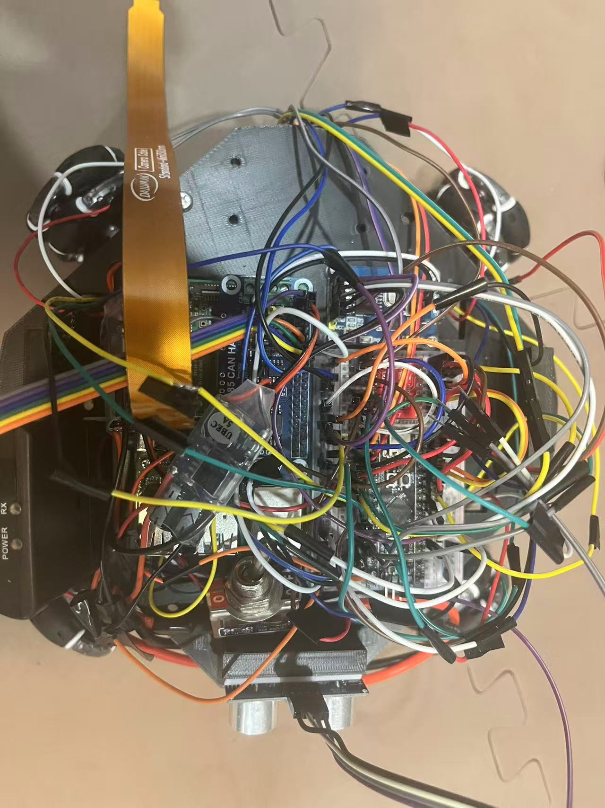
    <figcaption>Top view of the rover.</figcaption>
  </figure>
  <figure>
    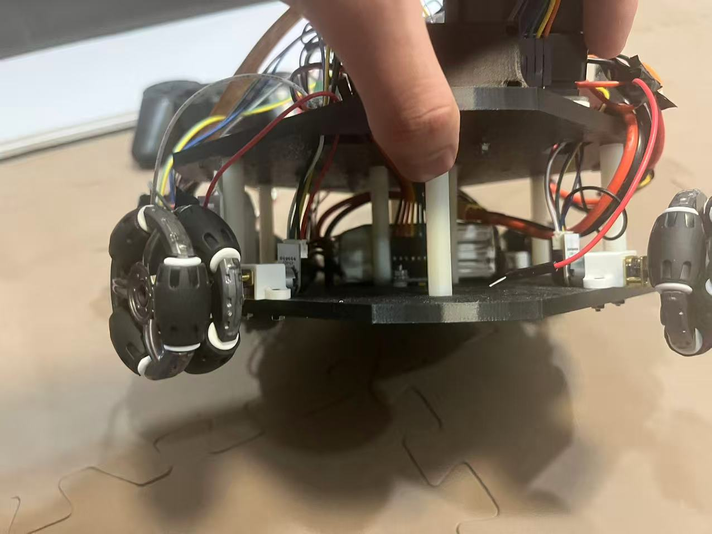
    <figcaption>Side view of the two decks.</figcaption>
  </figure>
  <figure>
    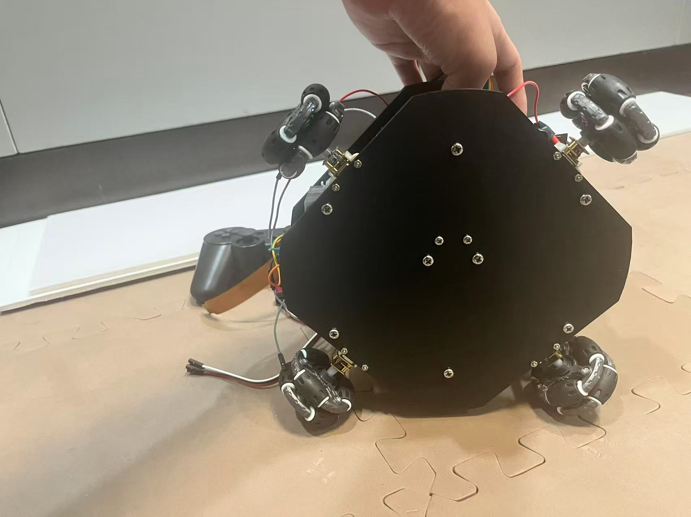
    <figcaption>Bottom view with the four motors.</figcaption>
  </figure>

## My starting point

I used the
[MERL ROSIE project](https://github.com/MERL-Rose-Hulman/MERL-Rose-Hulman.github.io/tree/main)
as my first reference. It gave me a basic idea for the frame and the electronics.
I did not copy its exact shape.

I picked a very simple frame. It has two plates and several standoffs. I started
with a square. I rounded the corners until the shape looked good. I made it
large enough for a Raspberry Pi 4B.

## The two plates

I used M4 screws and nylon standoffs. I placed the screw holes where the load
looked even. I then copied the plate to make the second deck.

  <figure>
    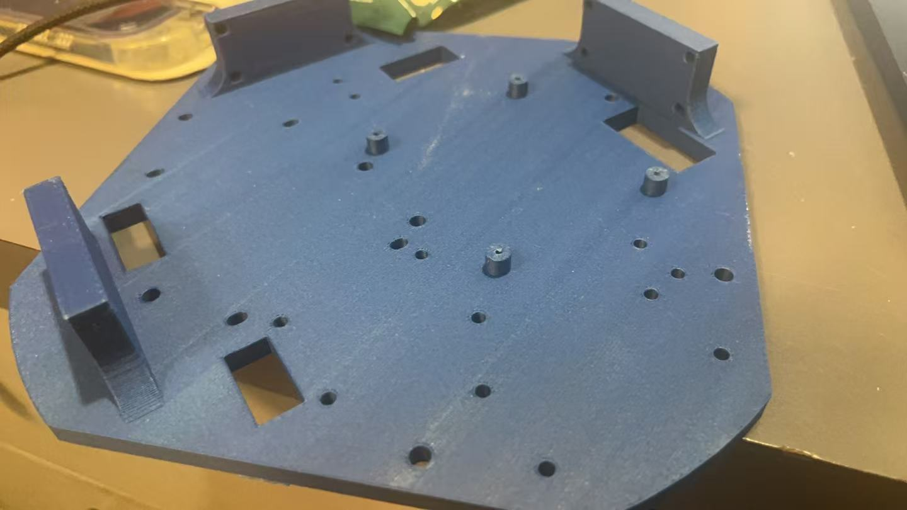
    <figcaption>The printed top plate.</figcaption>
  </figure>
  <figure>
    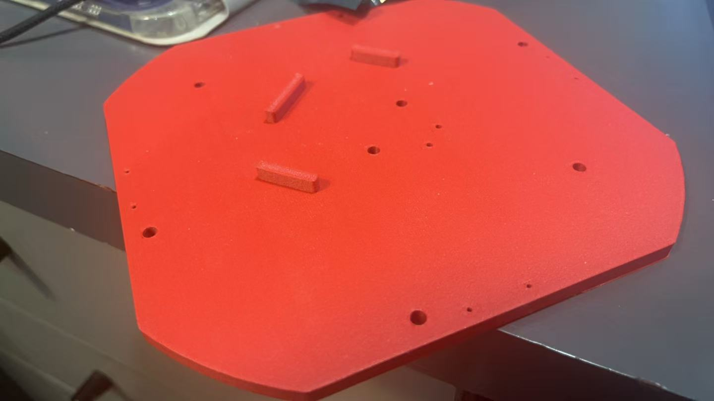
    <figcaption>The printed bottom plate.</figcaption>
  </figure>

The clean SolidWorks view below shows the plate shape and the main holes.

:::{figure} ../_static/week1/solidworks-top-layout.png
:alt: Clean SolidWorks top view of the rover plate and mounting holes
:class: chapter-wide-figure
:align: center

SolidWorks top view of the plate.
:::

The next two images are working sketches. They show many sizes, but they are
hard to read. They are useful as a design record. They are not clean shop
drawings.

  <figure>
    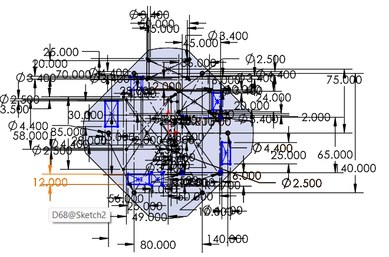
    <figcaption>Working dimension sketch 1.</figcaption>
  </figure>
  <figure>
    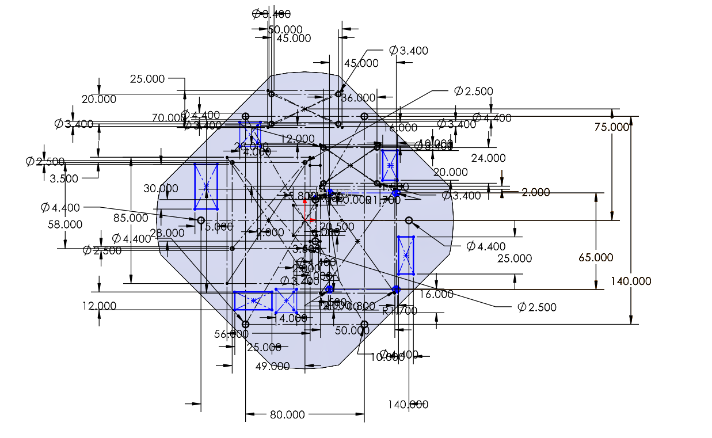
    <figcaption>Working dimension sketch 2.</figcaption>
  </figure>

The wheel radius is 25 mm. The center-to-wheel distance is 115 mm.

:::{admonition} Still needed - clean CAD drawing
:class: asset-placeholder

Add one clean drawing with the plate width, corner size, plate thickness,
standoff holes, motor holes, wheel center, and front direction. Hide unused
sketch sizes so the drawing is easy to read.
:::

## Plan the deck before drilling holes

I made a parts list before I finished the holes. You need to know what will sit
on the plate before you drill it.

The top deck has space for a breadboard and a Raspberry Pi. I also left space
near the corners for HC-SR04 sensors or cameras.

The lower deck holds the battery and IMU near the center. This keeps the heavy
parts low. I also hoped the center position would help the IMU. I did not test
that idea in Week 1, so it is only a design choice.

  <figure>
    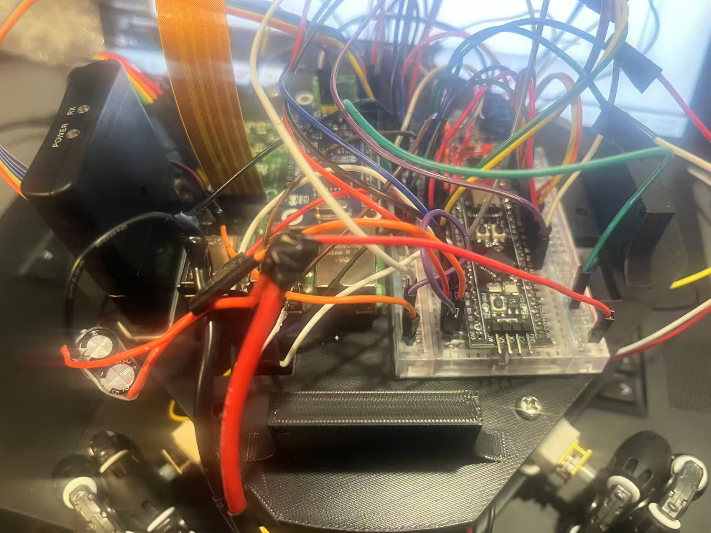
    <figcaption>Top layer with the Raspberry Pi and wiring.</figcaption>
  </figure>
  <figure>
    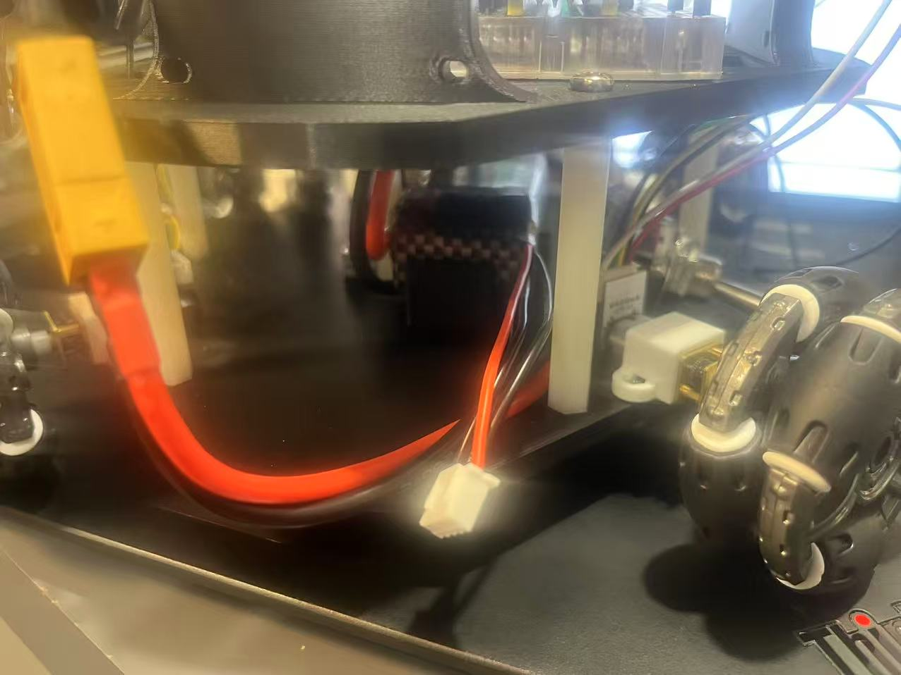
    <figcaption>Bottom layer with power and motor parts.</figcaption>
  </figure>

:::{admonition} Still needed - mechanical BOM
:class: asset-placeholder

Add the exact plate material, screws, standoffs, motor mounts, wheel mounts,
mass, price, and seller links.
:::

## Measure the real parts

The mounting holes took more time than the plate shape. I first looked for
drawings online. Many drawings were missing sizes. Some clone boards also had
different holes.

The easier method was to use calipers on the real board. I made the CAD holes a
little larger when the fit did not need to be exact.

:::{admonition} Still needed - hole measurements
:class: asset-placeholder

Add the caliper data for each board. Mark which sizes came from a datasheet and
which sizes came from the real part.
:::

## Print with extra strength and space

I was worried that the plates would bend. My first print used PLA-CF and many
wall layers. Later, my load check showed that normal PLA was probably enough.

I would still leave extra space and strength. A research robot often gets more
sensors, wires, and small boards later.

:::{admonition} Still needed - print data
:class: asset-placeholder

Add the printer, filament, nozzle, layer height, wall count, infill, print time,
plate mass, and load check.
:::

## Split the work between two computers

The Raspberry Pi runs ROS 2, localization, and SLAM. I used a Raspberry Pi 4B
with 8 GB of RAM and a 32 GB microSD card. I suggest at least 32 GB of storage.
Visual SLAM can use a lot of space.

The Raspberry Pi runs Linux. Linux is not the best place for exact motor timing.
I used a microcontroller for:

- four PWM motor outputs
- four encoders
- motor direction pins
- CAN messages
- heartbeat safety
- sensor timing

I picked STM32 because it is fast, cheap, and has good hardware timers. The bad
part is the tool setup. It also needs an ST-Link.

You can use another MCU. Make sure it has enough timers, pins, and speed.

## My timer mistake

I first bought an STM32F103 Blue Pill. I did not count the timers first.

The rover needs one timer with four PWM channels. It also needs four more timers
for the four encoders. This means I needed five timers.

The F103 board did not fit this plan. I changed to an STM32F411CEU6 Black Pill.
The F411 had the five timers I needed.

| Job | Final timer |
| --- | --- |
| Four motor PWM channels | TIM1 |
| Front-left encoder | TIM2 |
| Front-right encoder | TIM3 |
| Rear encoder 1 | TIM4 |
| Rear encoder 2 | TIM5 |

The lesson is simple: count timers, channels, pins, and pin conflicts before
you buy the MCU.

## Why I used CAN

I needed a link between the Pi and STM32. I used CAN because I wanted to learn
how cars send messages between control units.

The Raspberry Pi uses a Waveshare CAN HAT. The STM32 side uses an MCP2515 and a
TJA1050. The MCP2515 is the CAN controller. The TJA1050 sends the electrical
CAN signal on the wire.

The STM32F411 does not have a built-in CAN controller. This made CAN much harder.
UART would have been enough for this rover. If you only want to build the rover,
I suggest UART. Use CAN only if learning CAN is also one of your goals.

## Main parts

These are the main parts I used.

  <figure>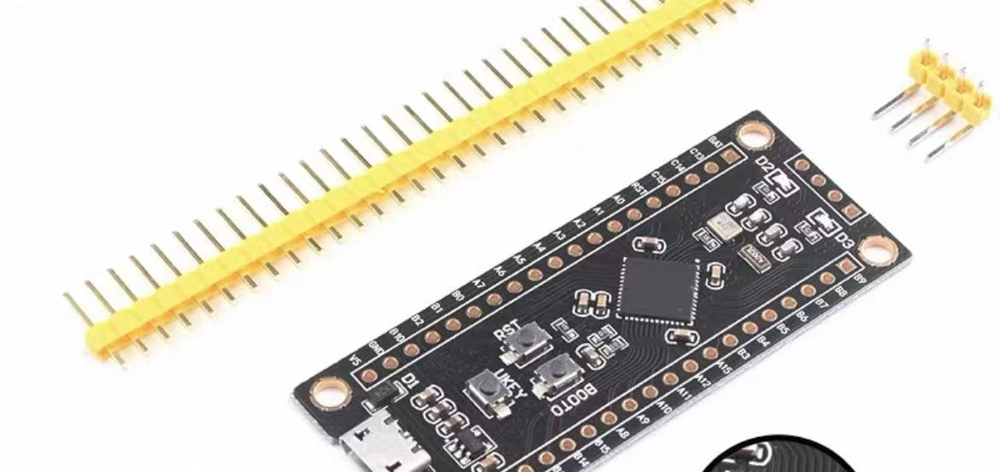<figcaption>STM32F411 board</figcaption></figure>
  <figure>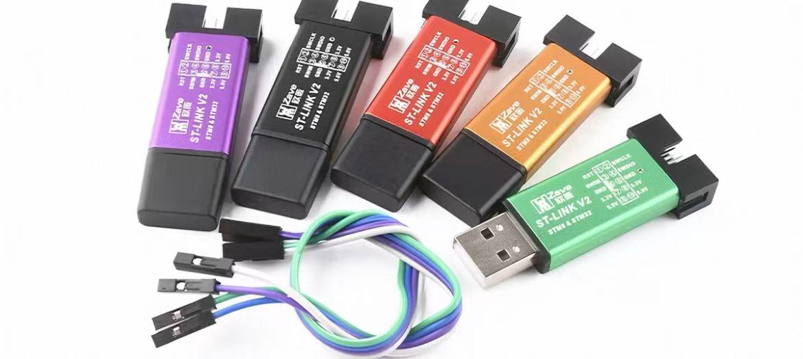<figcaption>ST-Link</figcaption></figure>
  <figure>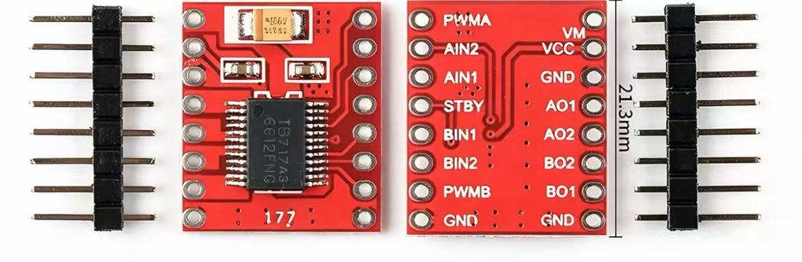<figcaption>TB6612 driver</figcaption></figure>
  <figure>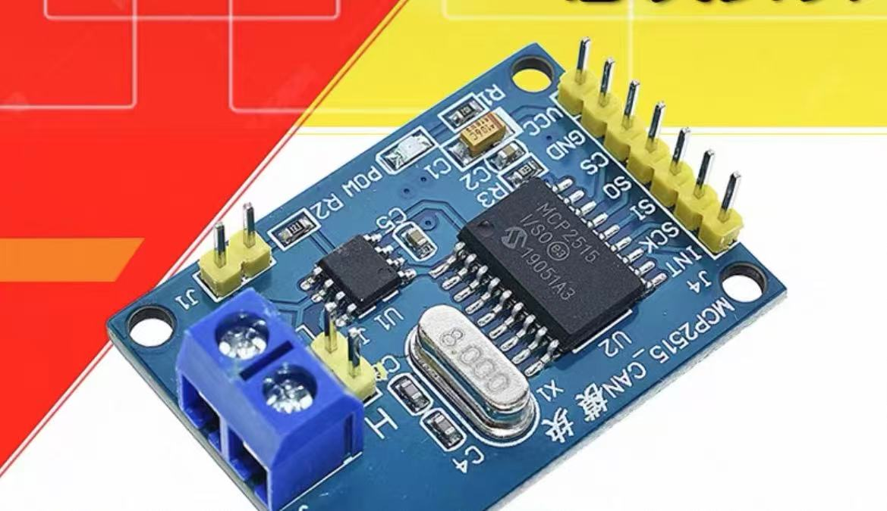<figcaption>MCP2515 CAN module</figcaption></figure>
  <figure>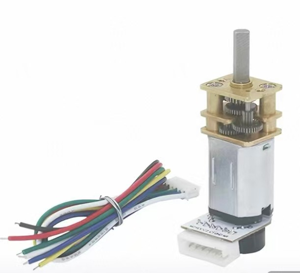<figcaption>Motor and encoder</figcaption></figure>
  <figure>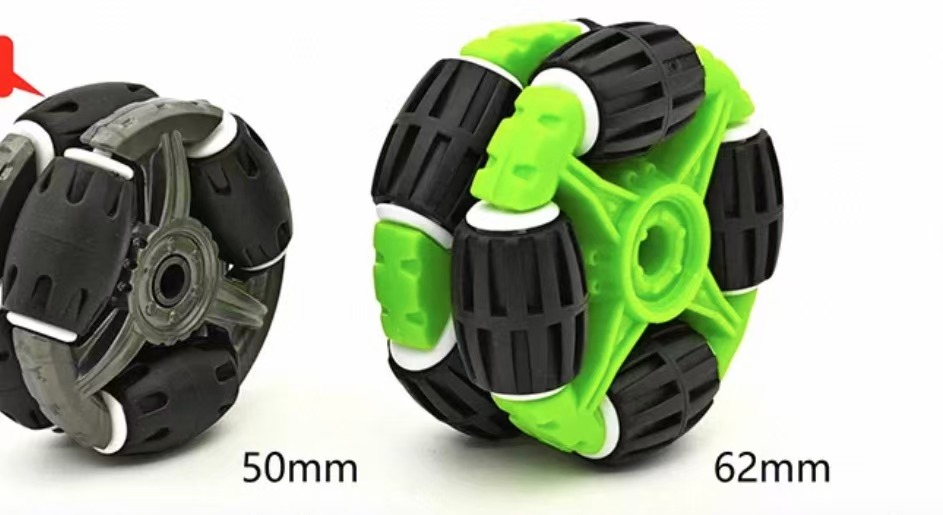<figcaption>50 mm omni wheel</figcaption></figure>
  <figure>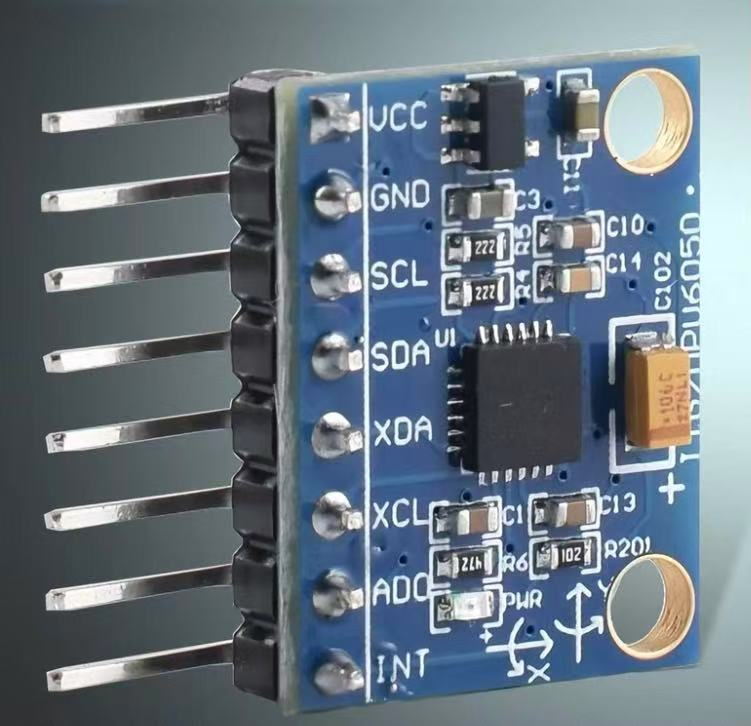<figcaption>MPU6050 IMU</figcaption></figure>
  <figure>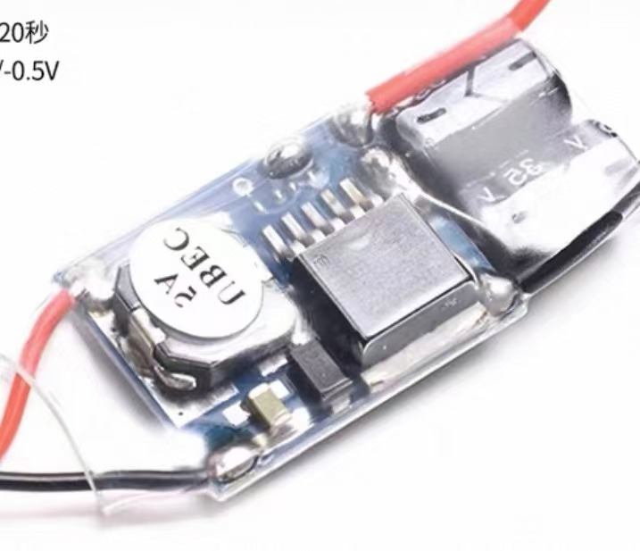<figcaption>5 V UBEC</figcaption></figure>
  <figure>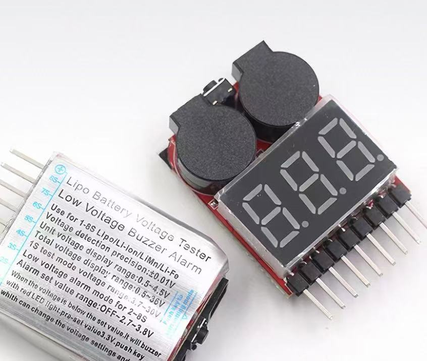<figcaption>LiPo alarm</figcaption></figure>
  <figure>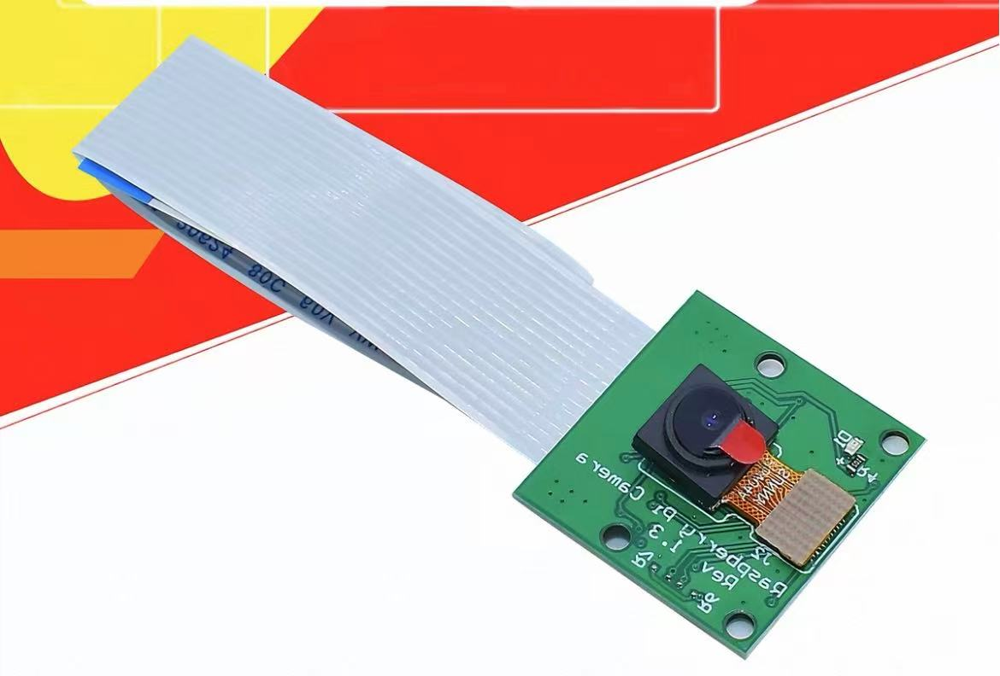<figcaption>Camera</figcaption></figure>
  <figure>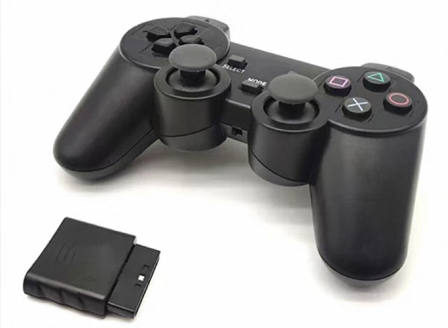<figcaption>PS2 controller</figcaption></figure>

:::{admonition} Still needed - full electrical BOM
:class: asset-placeholder

Add the exact model, number, voltage, seller link, price, connector, and safe
replacement for each part.
:::

## Battery and power

I looked at three choices: a power bank, battery holders, and a LiPo battery.
The holders used too much space. The power bank cost more than I needed. I used
a 3S 1500 mAh 35C LiPo. My record says 11.4 V.

The LiPo sends motor power to the TB6612 boards. At first, one 5 V, 5 A UBEC
powered the low-voltage parts. Later, I gave the Raspberry Pi its own 5 V, 5 A
power branch. I wanted to keep motor faults away from the most costly board.

Two power branches do not always mean galvanic isolation. They may still share
GND. A CAN or UART wire can also join the two sides. A real isolated system must
isolate both power and signal paths.

An isolated DC-DC may lower the chance that one fault reaches every board. It
cannot stop every short circuit. You still need careful wiring, fuses, and
current limits.

:::{admonition} Still needed - clear power tree
:class: asset-placeholder

Draw the old and new power trees. Show the battery, both 5 V/5 A branches,
fuses, switches, GND, Raspberry Pi power input, STM32, CAN modules, TB6612
logic power, and motor power. Mark every real isolation point.
:::

## Full wiring reference

The diagram below is my full breadboard wiring record. It is dense, so open the
PDF when you need to read a wire.

:::{figure} ../_static/week1/wiring-schematic.jpg
:alt: Full Fritzing breadboard wiring diagram for the rover
:class: chapter-wide-figure
:align: center

Breadboard wiring for the rover. This is a wiring map, not a clear power tree.
:::

<a href="../_static/week1/wiring-schematic.pdf">Download the full wiring PDF</a>

- [Open the Fritzing source](https://github.com/Tuomaaa/XDriveSLAMRover/blob/main/SCHE/schematic.fzz)
- [Open the KiCad schematic](https://github.com/Tuomaaa/XDriveSLAMRover/blob/main/SCHE/SCHE.kicad_sch)

(power-rail-incident)=
## Two short-circuit accidents

I had two serious electrical faults. I do not know the exact short point for
either fault. I will not write a guess as if it were a fact.

The first fault broke:

- one ST-Link
- one STM32
- two TB6612 boards

The second fault broke:

- one STM32
- one TB6612 board

The total was two STM32 boards, three TB6612 boards, and one ST-Link. The
Raspberry Pi stayed safe because I handled its power path on its own.

After a possible short, I use this check:

1. Remove the battery, USB, ST-Link, and every other power source.
2. Check resistance or continuity from GND to 3.3 V, 5 V, and 12 V.
3. Check weak GPIO or power pins against GND.
4. Compare the result with a good board when possible.
5. Wait and see if the resistance rises while capacitors charge.
6. Test the ST-Link by itself. My broken ST-Link did not light up.
7. Add one board at a time with a current-limited bench supply.

A continuity beep does not prove that a board is broken. No beep also does not
prove that a board is good. This is only a fast first check.

The main lesson is to respect 12 V. Turn off all power before changing wires.
Keep 12 V away from 3.3 V and 5 V wires. Use fuses and current limits. Test one
power branch at a time. Keep spare low-cost boards.

:::{admonition} Still needed - accident records
:class: asset-placeholder

Add photos of the broken boards, dates, meter readings, and the wiring state.
Keep the cause as unknown unless new evidence proves it.
:::

## Part 2 - Program the rover

Hardware and code are part of the same bring-up step. A motor is not ready
until code can turn it. An encoder is not ready until code can show its value.

The STM32 tools took more time than I expected. Most of that work was not about
localization or SLAM. My goal now is to show the shortest path that worked for
me.

## Set the pins in STM32CubeMX

I used
[STM32CubeMX](https://www.st.com/en/development-tools/stm32cubemx.html).

My steps were:

1. Pick the STM32F411CEU6.
2. Set TIM1 for four PWM outputs.
3. Set TIM2, TIM3, TIM4, and TIM5 for encoders.
4. Set SPI and GPIO pins for the MCP2515.
5. Set the motor direction pins.
6. Set SWD for the ST-Link.
7. Check the clock tree and pin conflicts.
8. Generate code.

The full setup is in
[stm32/SummerSLAM.ioc](https://github.com/Tuomaaa/XDriveSLAMRover/blob/main/stm32/SummerSLAM.ioc).
Open this file in CubeMX to see the real settings.

:::{admonition} Still needed - short CubeMX guide
:class: asset-placeholder

Add the tested CubeMX version and screenshots for MCU choice, pin setup, clock
tree, project settings, and Generate Code.
:::

## Build with CMake in VS Code

I suggest using the CMake files in this project:

- [stm32/CMakeLists.txt](https://github.com/Tuomaaa/XDriveSLAMRover/blob/main/stm32/CMakeLists.txt)
- [stm32/CMakePresets.json](https://github.com/Tuomaaa/XDriveSLAMRover/blob/main/stm32/CMakePresets.json)
- [CubeMX CMake file](https://github.com/Tuomaaa/XDriveSLAMRover/blob/main/stm32/cmake/stm32cubemx/CMakeLists.txt)

I installed the STM32 extension in VS Code. I could build the project there. I
could not make every feature in the extension work well.

My final steps were:

1. Set the pins and generate code in CubeMX.
2. Open the project in VS Code.
3. Use the CMake preset.
4. Build the code.
5. Flash it with STM32CubeProgrammer.

I saw many tool, path, CMake, and library errors. I spent too much time on them.
An LLM can help explain an error and give you a short test list. Show it the
full error message. Change one thing at a time. Build again after each change.
Do not accept a large fix that you do not understand.

:::{admonition} Still needed - short build guide
:class: asset-placeholder

Add the VS Code extension name, Arm toolchain version, CMake version, Ninja
version, PATH setup, build commands, output file, and a good build log.
:::

## Flash with STM32CubeProgrammer

I used
[STM32CubeProgrammer](https://www.st.com/en/development-tools/stm32cubeprog.html)
to flash the STM32. I did not keep fighting the VS Code extension.

The basic steps are:

1. Connect ST-Link to SWD.
2. Open CubeProgrammer.
3. Connect to the STM32.
4. Pick the built firmware.
5. Program and verify it.
6. Reset the board.

A USB-to-TTL adapter is also useful for debug text. Check the current pin file
before using it. This project later used the old UART pins for ultrasonic
sensors.

:::{admonition} Still needed - short flash guide
:class: asset-placeholder

Add the CubeProgrammer version, SWD wiring, target voltage, firmware path,
screenshots, and common connection errors.
:::

## Use Dupont wires first, but not forever

First, I used Dupont wires to test every part. This is a good way to check the
design before making a PCB.

I kept the Dupont wires for too long. Near the end, the rover had too many loose
wires. A loose wire looked like a code bug. Moving one wire could break another
wire. A PCB would have saved a lot of time.

Do not be too afraid of PCB design. This rover is a low-speed system. Start with
a clear schematic. Use clear net names. Check plug direction, voltage, current,
decoupling, GND, and test points. Run ERC and DRC.

DRC cannot tell you that the whole circuit is correct. An LLM may find a wrong
name or a missing wire in a schematic, but it cannot fully check a PCB. You
still need datasheets and your own checks.

A good time to order the PCB is when you start the kinematics work. You can
write code while the board is being made.

:::{admonition} Still needed - PCB redesign
:class: asset-placeholder

Add the new schematic, PCB layout, ERC/DRC results, Gerber files, PCB BOM, test
points, power checks, and first power-on test. The current KiCad PCB file is not
a finished or tested board.
:::

## Make one motor turn

Start with one motor. Lift the wheel off the floor. Start the PWM timer. Set the
two direction pins. Use a low PWM value first.

The full motor code is in
[stm32/Core/Src/main.c](https://github.com/Tuomaaa/XDriveSLAMRover/blob/main/stm32/Core/Src/main.c).
The function motor_set_pwm() sets direction and limits the PWM value.

Test one motor before all four motors. This makes wiring mistakes easier to
find.

:::{admonition} Still needed - small motor code example
:class: asset-placeholder

Add the exact C code for one motor and four motors. Show the TIM1 channel, GPIO
pins, PWM speed, STBY pin, and expected wheel direction.
:::

## Read the encoders

The STM32 timer can read an encoder in hardware. The final code starts TIM2,
TIM3, TIM4, and TIM5 with HAL_TIM_Encoder_Start and TIM_CHANNEL_ALL.

TIM3 and TIM4 are 16-bit timers. The full encoder_update() code keeps a larger
count when these timers wrap around.

At this step, only check that each encoder count changes. Do not fix every sign
or wheel name yet. Week 3 covers wheel mapping, sign, CPR, and odometry.

:::{admonition} Still needed - small encoder code example
:class: asset-placeholder

Add one short C example for one encoder and one for all four encoders. Show the
timer map, read time, and 16-bit wrap code.
:::

## Test CAN

The STM32 uses
[mcp2515.c](https://github.com/Tuomaaa/XDriveSLAMRover/blob/main/stm32/Core/Src/mcp2515.c).
The Pi uses
[can_interface.py](https://github.com/Tuomaaa/XDriveSLAMRover/blob/main/ros2_ws/src/can_interface.py)
and
[protocol.py](https://github.com/Tuomaaa/XDriveSLAMRover/blob/main/ros2_ws/src/protocol.py).
The CAN speed is 500 kbit/s.

Start CAN on the Pi:

:::{code-block} console
sudo ip link set can0 up type can bitrate 500000
candump can0
:::

Use the encoder monitor for an easier view:

:::{code-block} console
cd ros2_ws/src
sudo python3 encoder_monitor.py
:::

Turn each wheel by hand. Check that one encoder value changes. candump shows
the raw 0x200 and 0x201 messages.

:::{admonition} Still needed - full CAN setup
:class: asset-placeholder

Add the Pi CAN HAT setup, clock value, overlay, reboot steps, wiring,
termination, loopback test, and good candump output.
:::

(can-stack-failures)=
## CAN and tool problems I found

- The MCP2515 library read the wrong register after send. I changed it to read
  the real TXBnCTRL register.
- The library did not include the needed can_frame type. I added can.h.
- CubeMX could remove CMake changes after Generate Code. Check the MCP2515 file
  after each new code generation.
- A Python match case used a plain name. Python treated it as a new variable,
  not a value to compare. I used if and elif.
- Raspberry Pi GPIO is not safe at 5 V. The PS2 receiver uses 3.3 V. The
  TJA1050 CAN board still needs its stated 5 V supply.

## Add the PS2 controller

I did not plan for a hand controller at first. I later bought a low-cost
PS2-style wireless controller.

The Pi driver is
[PS2.py](https://github.com/Tuomaaa/XDriveSLAMRover/blob/main/ros2_ws/src/PS2.py).
It uses GPIO bit-banging for the PS2-like signal. The drive code is
[PS2_Drive_Test.py](https://github.com/Tuomaaa/XDriveSLAMRover/blob/main/ros2_ws/src/PS2_Drive_Test.py).
It turns controller input into four motor commands and sends them over CAN.

This driver also took too much time. The low-level controller signal is not the
main topic of this project. Use a good library if one works with your receiver.
An LLM can also help write a small driver. You must still check voltage, timing,
button values, and stop behavior on the real hardware.

:::{admonition} Still needed - controller data
:class: asset-placeholder

Add the exact controller model, seller link, Chinese datasheet, receiver pins,
button map, pairing steps, and measured signal timing.
:::

Run the drive test:

:::{code-block} console
cd ros2_ws/src
sudo python3 PS2_Drive_Test.py
:::

Lift the rover first. Check forward, back, left, and right. Keep a fast way to
remove power. Check the heartbeat stop before driving on the floor.

## Drive test

The video below shows the rover moving during bring-up.

<video class="chapter-video" controls preload="metadata">
  <source src="../_static/week1/drive-test.mp4" type="video/mp4">
  Your browser does not support this video.
</video>

The video proves that the rover can move. It does not prove every motor speed,
controller state, or safety case.

:::{admonition} Still needed - full drive test record
:class: asset-placeholder

Add the test date, firmware commit, wiring, commands, supply voltage and
current, wheel direction table, controller state, heartbeat-stop result, and
failed tries.
:::

## What worked at the end

One motor worked first. Then all four motors worked. The encoders sent counts.
The STM32 sent encoder data to the Raspberry Pi over CAN. The rover also moved
during the drive test.

This does not mean that every later feature was ready. Closed-loop speed,
calibrated odometry, full controller testing, localization, and SLAM belong to
later tests.

## What I would change next time

1. Finish the BOM before making holes.
2. Count MCU timers and pins before buying the board.
3. Use UART unless CAN is part of the learning goal.
4. Draw the power tree before connecting the LiPo.
5. Add fuses, current limits, and plugs that cannot be reversed.
6. Keep 12 V, 5 V, and 3.3 V wires easy to tell apart.
7. Test one power branch and one motor at a time.
8. Keep spare STM32, TB6612, and ST-Link boards.
9. Make a PCB after the Dupont test works.
10. Leave room for new sensors and wires.

## Source files

- [stm32/SummerSLAM.ioc](https://github.com/Tuomaaa/XDriveSLAMRover/blob/main/stm32/SummerSLAM.ioc)
- [stm32/Core/Src/main.c](https://github.com/Tuomaaa/XDriveSLAMRover/blob/main/stm32/Core/Src/main.c)
- [Fritzing source](https://github.com/Tuomaaa/XDriveSLAMRover/blob/main/SCHE/schematic.fzz)
- [KiCad schematic](https://github.com/Tuomaaa/XDriveSLAMRover/blob/main/SCHE/SCHE.kicad_sch)
- [Project state](https://github.com/Tuomaaa/XDriveSLAMRover/blob/main/PROJECT_STATE.md)
- [MERL ROSIE reference](https://github.com/MERL-Rose-Hulman/MERL-Rose-Hulman.github.io/tree/main)

## Current check state

Single-motor drive, four-motor drive, encoder output, and the hardware CAN link
have real test evidence. The drive video also shows the rover moving.

I still need clean BOM data, a clean CAD drawing, a power tree, short software
guides, small code examples, the PCB redesign, accident records, and a full
controller and safety test record.
